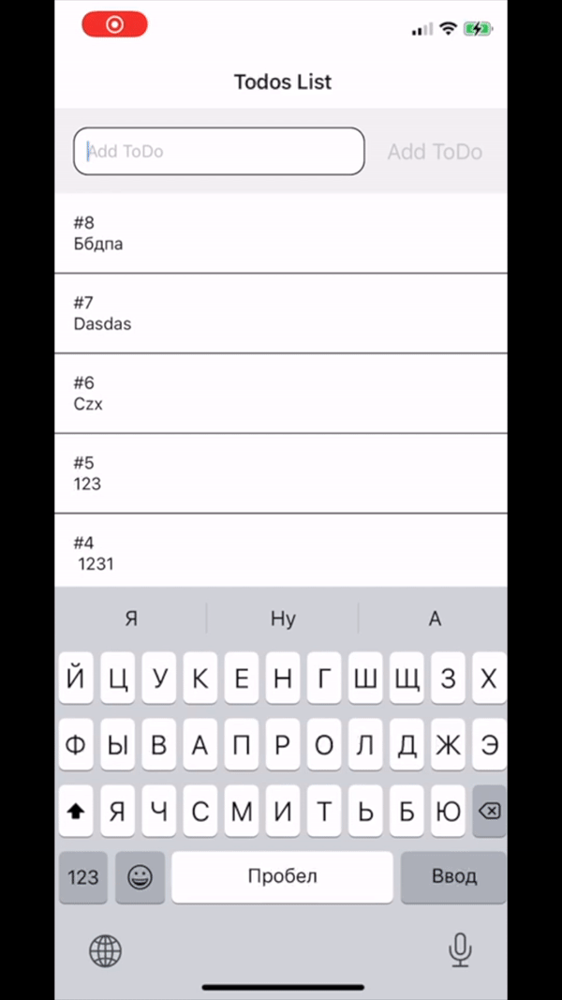

## Preview

## Patches

1) react-native-fetch-api
    - changed fetch response type to base64
2) metro-react-native-babel-preset
    - disabled @babel/plugin-transform-exponentiation-operator plugin
3) @dfinity/agent
    - Wasm implementation of bls_verify replaced with js implementation
    
## Canisters

- start locally canister for simple to-do app (https://github.com/krpeacock/simple-to-do)
- setup ngrok for port 8000 (ngrok http 8000)
- copy link of ngrok and change `host` in Todo actor agent (`src/utils/actor.ts`)
- change canister id to your local for actor (`src/utils/actor.ts`)
- launch the app

# How to start

### Before start
Make sure that you've setup propper team for iOS project.
And also please check **Canisters** section in the README. Please setup locally to-do canister, ngrok and update `host` and `canisterId` variables

### Start

- `yarn install`
- `cd ios && pod install`
- For iOS: `npx react-native run-ios` OR run the project with xcode and run it
- For Android: `npx react-native run-android`
